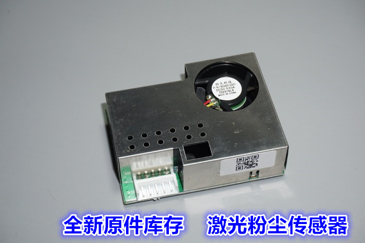

# PM2.5激光粉尘传感器 参数

wvv 20200414

某宝低价收的粉尘传感器，最近拿出来使用了一下，

 https://item.taobao.com/item.htm?spm=a1z09.2.0.0.67002e8dcFpPoI&id=590780778829&_u=ei2312taa6e 

现在已经下价，没有资料，传感器外观如下：



经过测试，发现其直接串口通信，波特率9600，串口定期输出粉尘参数，如下：

```
[14:30:11.207]收←◆A5 F2 04 2D 00 2F 00 28 00 00 7A 
[14:30:12.208]收←◆A5 F2 04 2A 00 2C 00 26 00 00 72 
[14:30:13.209]收←◆A5 F2 04 28 00 2A 00 24 00 00 6C 
[14:30:14.211]收←◆A5 F2 04 29 00 2B 00 25 00 00 6F 
[14:30:15.212]收←◆A5 F2 04 29 00 2B 00 25 00 00 6F 
[14:30:16.212]收←◆A5 F2 04 2A 00 2C 00 26 00 00 72 
[14:30:17.213]收←◆A5 F2 04 2C 00 2E 00 28 00 00 78 
[14:31:13.270]收←◆A5 F2 04 28 00 29 00 23 00 00 6A 
[14:31:14.271]收←◆A5 F2 04 28 00 29 00 22 00 00 69 
[14:31:15.272]收←◆A5 F2 04 28 00 29 00 23 00 00 6A 
[14:31:16.273]收←◆A5 F2 04 29 00 2A 00 23 00 00 6C 
[14:31:17.273]收←◆A5 F2 04 2A 00 2B 00 24 00 00 6F 
[14:31:18.275]收←◆A5 F2 04 2C 00 2D 00 25 00 00 74 
```

经过比对发现：

1-3个字节为帧头，

4-5字节，6-7字节，8-9字节分别对应PM2.5/1/10参数，高位在后，

第10字节永远为0，

第11字节为校验码，校验算法为 4-9字节数据求和再减去0x0a

使用方法：

可以usb转ttl连接电脑或者单片机，读取串口数据，再进行显示。