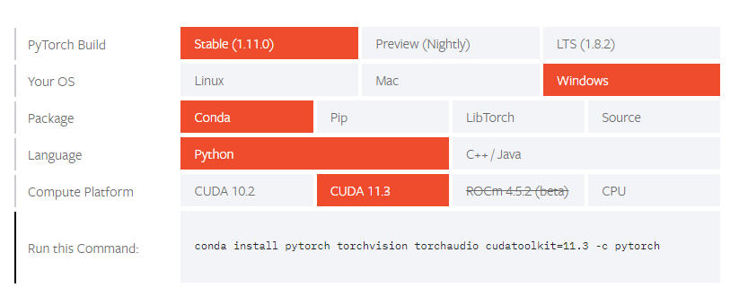
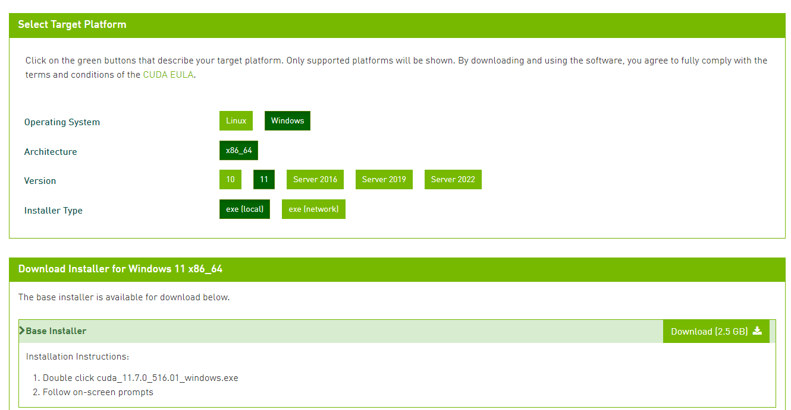

# pytorch 笔记

[toc]

### windows环境搭建

#### 安装anaconda

官网:**https://www.anaconda.com/**

作用: anaconda**非必须**，此处用于提供创建python虚拟环境，可以用其他虚拟环境替代，在环境搭建时，可能经常要切换各种版本，为了便于管理需要。

开始菜单中点击 Anaconda Powershell Prompt可以进入命令行模式，常用命令如下：

```shell
#列出当前环境
conda env list
#建立新环境,name 为环境名称
conda create -n name python=x.x 
#激活虚拟环境
conda activate name
#退出虚拟环境
conda deactivate
```

conda 自己集成了包管理器，类似于pip，在python环境搭建时，用pip和conda安装包都是可以的。

conda源配置：在国内，为了加速，需要配置包源，类似于配置pip的源的方法，下面例子为配置为中科大源。

```shell
conda config --add channels https://mirrors.ustc.edu.cn/anaconda/pkgs/main/
conda config --add channels https://mirrors.ustc.edu.cn/anaconda/pkgs/free/
conda config --add channels https://mirrors.ustc.edu.cn/anaconda/cloud/conda-forge/
conda config --add channels https://mirrors.ustc.edu.cn/anaconda/cloud/msys2/
conda config --add channels https://mirrors.ustc.edu.cn/anaconda/cloud/bioconda/
conda config --add channels https://mirrors.ustc.edu.cn/anaconda/cloud/menpo/
conda config --set show_channel_urls yes
```

上述的指令在windows系统上实际上是配置了 用户文件夹/**.condarc** 文件，也可以直接编辑该文件配置源。

#### 安装pytorch

官网：**https://pytorch.org/**

下载地址：**https://pytorch.org/get-started/locally/**



进入下载链接后，可以看到上述界面，可以选择系统类型，包类型，cuda版本等。

注意几点：

* cuda10.2的版本，已经不支持通过conda脚本安装了。会提示

`CUDA-10.2 PyTorch builds are no longer available for Windows, please use CUDA-11.3`

* 选择cuda11.3版本，conda，下面会显示安装指令

`conda install pytorch torchvision torchaudio cudatoolkit=11.3 -c pytorch`

比较坑的地方在于自动生成的最后的的 -c pytorch 参数是强制使用官方源来下载，因为安装需要下载上G的文件，在没有梯子的情况下很难下载成功，为了加速下载，先配置好conda源，取消-c pytorch参数，执行的指令应该为：

`conda install pytorch torchvision torchaudio cudatoolkit=11.3`

* 既然选择cuda版本，首先要确保你的显卡是英伟达品牌，而且支持cuda开发。

* 这里特别要注意cuda版本的选择，这个版本号一定要和后续的cuda驱动一致，所有设计cuda的地方版本都应该尽量一致。

* 某些时候，运行conda安装的时候，pytorch可能会遇到各种各样的问题，特别要注意安装的是gpu版本，如果实在搞不定，可以采用自行下载离线包安装的方式，这也是我尝试多台电脑安装后最可靠的安装方式，下载链接：

https://download.pytorch.org/whl/torch_stable.html

**一定要下载自己对应的版本**，比如cuda11.3，那么需要下载文件名的前缀为cu113的文件，除了cuda版本，另外两个重要参数就是python版本和系统版本，文件名中的cp39就表示python版本3.9，windows下需要下载win_amd64，linux下载linux_x86_64版本。

下载下来后，进入虚拟环境，通过pip的方式安装即可。像torchvision之类建议版本越高越好，内置的功能越强。

* LibTorch是pytorch的c++/Java语言接口开发版本，当需要搭建c++开发环境时，需要进行相应下载，下载下来后解压到非中文文件夹，后续经过路径配置就可以使用了。对于11.3版本，下载链接如下：

**release版：** https://download.pytorch.org/libtorch/cu113/libtorch-win-shared-with-deps-1.11.0%2Bcu113.zip

**debug版：** https://download.pytorch.org/libtorch/cu113/libtorch-win-shared-with-deps-debug-1.11.0%2Bcu113.zip

#### 安装cuda

**官网：** https://developer.nvidia.com/

**cuda toolkit下载地址：** https://developer.nvidia.com/cuda-downloads



根据自己系统和前面torch版本下载安装对应的cuda，选择离线版本下载。

如果用到了cudnn，还需要单独进行下载，下载选择自己对应的cuda版本，下载地址：

https://developer.nvidia.com/rdp/cudnn-download

初次下载需要免费注册账号，将下载下来的压缩包根据官方安装说明解压到cuda安装目录。

#### 配置vscode

在windows上进行模型训练、python开发，建议使用vscode，自己网上看教程，配置好相应的环境设置，在python下，记得python解释器要选择虚拟环境中的那个。

#### 配置visual studio

在windows上进行模型推理，cpp开发，建议使用visual studio，特别要注意各种工程路径的设置问题。

其中对于cuda运行的坑在于，代码运行时发现cuda设备不可用，但是python环境下是可用的，通过搜索，发现需要在链接器/命令选项中添加

`/INCLUDE:?warp_size@cuda@at@@YAHXZ`

才能够识别cuda设备，对于cuda11.3的版本，可能会发现即使是添加了上面的语句，模型加载没问题了，但是推理的时候会报莫名的错误，经过查阅官网github讨论群才发现，还需要添加

`/INCLUDE:?_torch_cuda_cu_linker_symbol_op_cuda@native@at@@YA?AVTensor@2@AEBV32@@Z `

相当于cuda11.3环境下，上面两处都要添加，中间用空格分开。

个人分析造成这个现象的原因是，torch自己lib导出的时候设置问题，这几个函数未导出为标准c格式，导致函数表未成功导出。

### 学习资料

官网教程: https://pytorch.org/tutorials/

#### torchvision模块

* datasets

* models

* transforms

### 模型基本操作

### 数据集准备

### 模型训练

### 模型导出

模型导出有几种方式：

* 只导出权重

```python
#导出权值
torch.save(model.state_dict(), model_out_path)
#导入权值
model.load_state_dict(torch.load(state_dict_path))
```

这种模式只存储了数据权值，这样导出模型文件是最小的，这种使用场景一般是训练的时候用于保存临时训练结果用，导入的时候要先建立好模型结构，再导入权值。

* 导出完整模型

```python
torch.save(model, model_out_path)
```

* 导出trace模型
  
  ```python
  device = torch.device("cuda:0")
  example = torch.rand(1, 3, 224, 224).cuda()
  model.set_swish(memory_efficient=False)
  model.to(device)
  model.eval()
  ts = torch.jit.trace(model, example)
  ts.save('./data/model/w.pt')
  ```

* 导出onnx模型

```python
torch.onnx.export(model,example,"data/model/effi.onnx")
```

### 模型可视化

目前netron 使用还比较方便

官网： https://netron.app/

### 模型推理/部署

#### python 环境

加载jit trace模型, 返回类型是 <class 'torch.jit._script.RecursiveScriptModule'>

```python
model = torch.jit.load('./data/model/w.pt')
device = torch.device("cuda:0")
model.to(device)
model.eval()
```

加载图片推理

```python
input_size = 224
def recog_img(model, img):
    trans = transforms.Compose([
        transforms.Resize(input_size),
        transforms.CenterCrop(input_size),
        transforms.ToTensor(),
        transforms.Normalize([0.5, 0.5, 0.5], [0.5, 0.5, 0.5])
    ])
    img_ = trans(img).unsqueeze(0)
    img_ = img_.cuda()
    outputs = model(img_)
    _,ind = torch.max(outputs,1)
    p = torch.nn.functional.softmax(outputs,dim=1)[0]
    per = round(p[int(ind)].item(),4)
    return (int(ind),per)
```

#### libtorch 环境/cpp

在生产环境中，为了提高性能，很多时候会采用cpp来开发，由于网络结构的构建是语言相关的，为了减少耦合，需要将网络结构和数据都导出为一个自描述的整体，再通过JIT（即时编译）的技术实现加载，这样就减少了系统间的耦合，我们可以在python导出模型的时候导出为jit trace模式或者onnx格式等，然后用cpp来进行加载，推理，一下提供加载jit trace模型示例。

```cpp
#include <torch/script.h>
#include <torch/torch.h>
#include <iostream>
#pragma comment(lib,"c10.lib")
#pragma comment(lib,"torch.lib")
#pragma comment(lib,"torch_cpu.lib")

#pragma comment(lib,"c10_cuda.lib")
#pragma comment(lib,"torch_cuda.lib")
#pragma comment(lib,"torch_cuda_cpp.lib")
#pragma comment(lib,"torch_cuda_cu.lib")
#pragma comment(lib,"cuda.lib")
#pragma comment(lib,"cublas.lib")
int main()
{
    std::cout << torch::cuda::is_available() << std::endl;
    std::cout << torch::cuda::cudnn_is_available() << std::endl;
    std::cout << torch::cuda::device_count() << std::endl;
    auto device = torch::kCUDA;
    try {
        auto model = torch::jit::load("./model/w.pt",device);
        model.eval();
        std::vector<torch::jit::IValue> inputs;
        inputs.push_back(torch::ones({ 1,3,224,224 }).to(device));
        torch::Tensor out = model.forward(inputs).toTensor();
        auto result = torch::softmax(out, 1);
        int id = torch::argmax(result).item().toInt();
        float fmax = result.max().item().toFloat();
        std::cout << id << "," <<fmax << std::endl;
    }
    catch (std::exception& e) {
        std::cerr << e.what() << std::endl;
    }
    return 0;
}
```

### 调试经验

1. cpp开发下，出错信息极其不友好，非常笼统，让人摸不着头脑，后面摸索后发现将有问题的地方通过try异常捕捉所有错误，输出信息，就能得到很多有用信息了。
